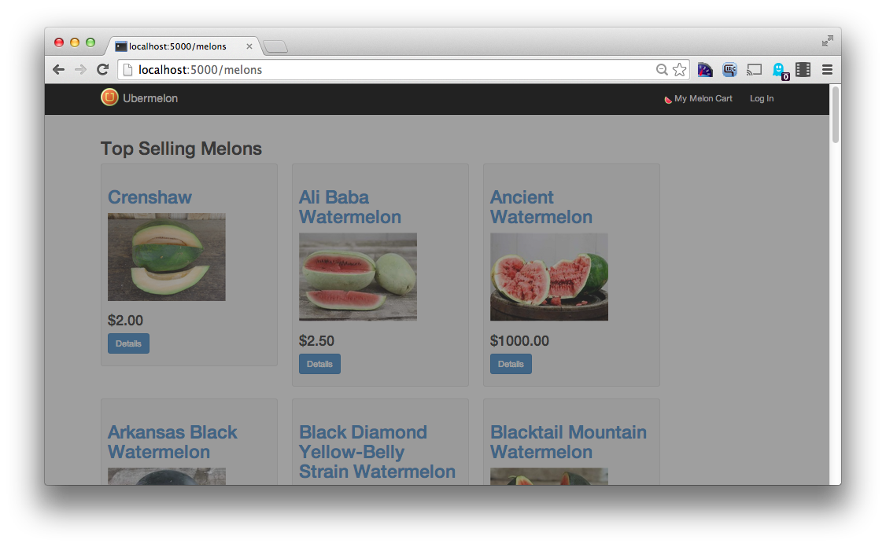
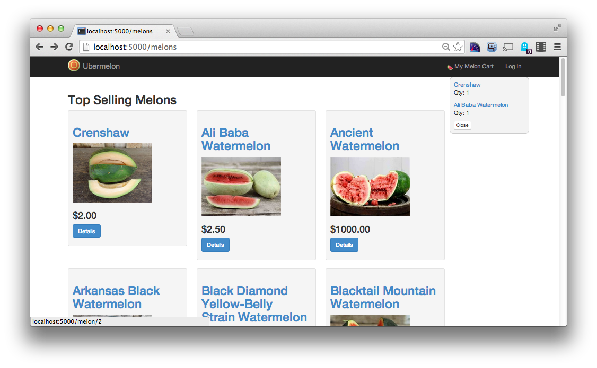
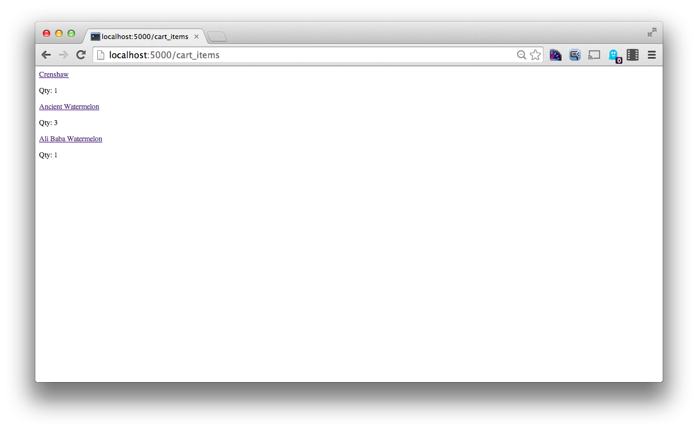
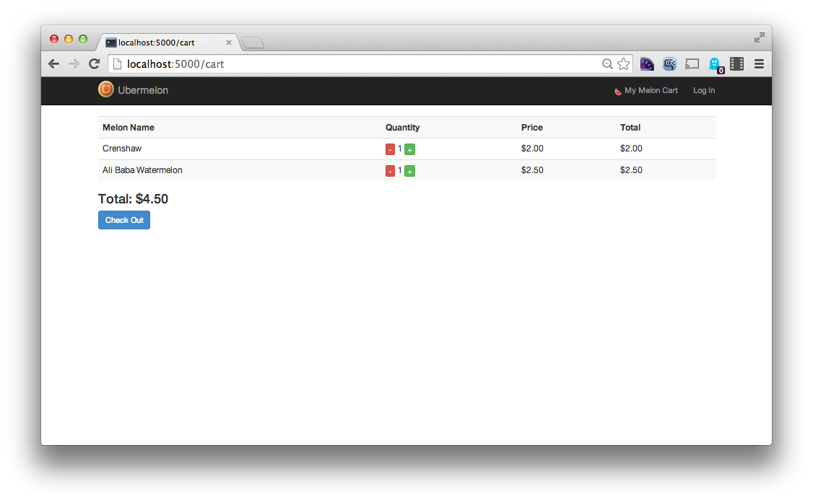

Jaaaaaaaaaaaavascript!
======================
Now that our ubermelon app _works_, we're going to add just a little bit of polish by improving some interactions with javascript and jQuery. We're going to add two dynamic interactions to the ubermelon site:

1. An annoying promotion popup screen
2. A shopping cart summary popup that updates with information from the server. 

Getting Set Up
--------------
The procedure is the same as before, mostly. Clone, virtualenv, etc. However, you will have to switch branches from the master branch to the ajax branch after cloning.

Navigate to [http://localhost:5000](http://localhost:5000) and get started.

Task 1: Summer Melon Sale
-------------------------
First we need to promote our annual melon summer sale. We're going to do it with a big banner that will force an interaction from the user before they can start browsing the available melons for sale. It looks like this:

In our particular style of using javascript, we can frame our usage as 'attaching functions to clickables'. For this first task, our function is to hide the promotional banner. The clickable is the 'close' button in the banner.

###Subtask 1: Create the banner
Not confident with your HTML and CSS? Read the [detailed instructions](sale_html.md).

The banner is made up of two parts: the grey screen to darken the page, and the banner itself. Built up in steps, it looks like this.

The gray box is just a div that is set to 100% width and height with gray as a background color. In the code going forward, it is given an id of `blackout-screen`. To make it annoyingly cover the entire screen no matter where you scroll, it is given the attribute of `position: fixed`, then has its `top` and `left` css styles set to zero.

To allow the elements under the blackout screen to show through, the background is set using the `rgba()` color function to give it an alpha value (transparency) of 0.5.

Inside the grey box is another div with the id of `promotion`, using the `jumbotron` class from bootstrap to give it the bordered appearance. It, too is given an attribute of `position: fixed` to make it stay where it is when the user scrolls. The box is 600px wide, with a 3px dark grey border. It's positioned about 100px from the top.

To center it horizontally, an unusual trick is used. We first specify an attribute of `left: 50%`. This aligns the left edge to the halfway point of the screen. Even if we squint, this is too far over to the right to be considered 'centered'. To center it, we can then use a negative margin to push it back to the left. Use a negative left margin of 300px to move it back.

To finish up, put an H1 tag inside the `jumbotron` div and color the text red. After that, add an link tag that doesn't go anywhere with the text 'Close this window' inside. Give that link a meaningful id, I chose `close-promotion` in the reference version.

###Subtask 2: Wire up the clicky clicky
'Wiring up' the javascript involves first defining a javascript action, then making that action happen in response to some user interaction. In our case, the 'action' we want to do is to hide the blackout screen. The user interaction we want to respond to is when the user clicks on the 'close promotion' button.

We'll build our javascript up in a sort of backwards fashion from most people: we'll develop the 'action' first, then install the 'event listener' second.

####The 'action'
**Before we write any javascript, we first need to create a script tag somewhere on the page. Put it at the end (but still inside) the body block of your `all_melons.html` file.**

Most javascript actions can be described in the following terms:

1. Get a reference to an element on the screen
2. Change an attribute of that element

An attribute can be any part of the tag, including the text contents, the css classes, or even individual css attributes. Our action, 'hide the blackout screen', can be thought of in those terms. It turns out that there are two different css attributes that control visibility on the screen. They are `visibility` and `display`. Setting visibility to `hidden` or display to `none` for any given element will hide that element.

So to hide the blackout screen, we first need a reference to it. After that, we can turn it invisible with one of our
css styles. If we were using raw javascript, it would look something like this:

    var blackout = document.querySelector("div#blackout-screen"); // Use css selectors to get a reference to the screen div
    blackout.style.visibility = "hidden"; // Hiding the screen also hides its contents
  
It's not too bad, but it's verbose. Instead, we're going to use jQuery shortcuts to do those two actions. We'll use the [jQuery selector](http://api.jquery.com/id-selector/) and the [jQuery .hide() method](http://api.jquery.com/hide/) to do those two things.

**In your javascript tag, write a function named `hideBlackoutScreen` that uses jQuery to disable the screen. You can test whether your function works by going into the development console and calling it directly. Make sure the function returns false at the end.**

####The 'event listener'
Now that we have an action to be performed, we just need to write some javascript to say 'call this action when a user clicks on this element'. To do this, we will install a [click event listener](http://api.jquery.com/click/). Event listeners are installed _onto_ page elements, in fact, it is just changing an attribute. Here is what it would look like in raw javascript:

    var closeLink = document.querySelector("a#close-promotion");
    closeLink.onclick = hideBlackoutScreen;
  
Naturally we won't be using raw javascript because it's tedious. We'll use the jQuery version of things.

We could theoretically install the event listeners at any time, but it makes sense to install them when the page loads. Like in python, we have an idea analogous to the `main` function, a function that executes before anything else, once the page has declared itself to be ready.

**In your javascript tag, write a function named `main` that installs a click event listener on the 'Close promotion' link.**

####Details
The main function needs to be called on page load. In python, we use the following construct to make it happen:

    if __name__ == "__main__":
        main()

Javascript, specifically jQuery, has a weird shorthand for making it happen. Don't question too much, just type this:

    $(main);
  
Now _bask_ in the glory of your first javascript interaction.

Task 2: Shopping cart popup (Ajax)
----------------------------------

We're going to add a small cart summary that shows when you hover over the melon cart in the navbar. This cart summary will be powered by ajax to _always_ reflect what is in the cart at any given time. If you have the site open in two different windows and add melons to the cart in one window, the other window will correctly show the cart summary on mouseover.

We'll do all of our work on the `melon_details.html` page because it's easier, but because the summary shows on every page, we'll move it to the base template when we've got it working.

In general, if our javascript techniques are used to change the display in response to some interaction, then AJAX is changing the display in response to the server sending more data to the browser. The only question is, how do we induce the server to send more data?

When building an AJAX interaction, it is best to approach the problem as before: build the HTML _without_ any javascript at first.

###The HTML
The HTML here is much more straightforward than before, we simply need a div with the id `cart` styled roughly as follows:

* 200 pixels wide
* 1 pixel border, #ccc in color
* 10 pixels of padding
* 10 pixel border radius (for those nice rounded corners)
* absolute positioning, 50 pixels from the top, 75 pixels from the right
* background color of #f3f3f3

We'll also need another div inside, called the `cart-target`. This is where all the cart items will go. We keep it separate so that it's easy for the javascript to just change the contents of this div in response to new data from the server.

Inside the cart target are placeholder divs that represent melons in the cart. Simply make a link and a `
` tag with the quantity in it:

    

        <a href="">Super Melon</a>
        
Qty: 5

    

Make two or three placeholder cart items to make sure you have your styling right and it matches the screenshot.

Add a link after your `cart-target` with the text Close, give it an id of `cart-close`. Optionally add the css class `btn btn-xs btn-default` to make it look like a button.

**When you're done, add a `display: none` attribute to the css to hide the cart summary.**

###The Javascript: Part 1
The javascript portion will be done in two parts. We'll write the interaction assuming that the contents of the cart summary div are static: ie, there is no AJAX call being made. This is almost exactly like the javascript in the first task, except we're showing an element instead of hiding it, and we're responding to the mouse rolling over an element instead of a click.

1.  Write a function called `showCartSummary()` that makes the cart div visible. Use jQuery's [.show()](http://api.jquery.com/show/) method.
2.  In your `main()` function, make the cart summary show in response to a [.mouseover()](http://api.jquery.com/mouseover/) of the `My Melon Cart` link in the navbar. You may have to add an id to the link to be able to do this.
3.  Write a function called `hideCartSummary()` that makes the cart invisible. Use the `.hide()` method as in our first task.
4.  In `main()`, make hideCartSummary trigger in response to clicking on your `cart-close` link.

###The Partial
Our AJAX call will be used to fill in the `cart-target` div with content from the server. For that, we need a url on the server to produce that content. For now, we can continue using static content.

The HTML that we're going to generate on the server side is not a full HTML page, it's only going to contain a small chunk of HTML that's going to be injected into a larger page. We'll call this incomplete chunk a 'partial'.

1.  Create a new route, `@app.route('/cart_items')` that renders a template called `_cart_items.html`. The leading underscore indicates it is a partial. There is no technical distinction from a regular page, it's just for us to be able to identify the difference.
2.  Move the placeholder items from your `cart-target` div into the `_cart_items.html` partial. Make sure the `cart-target` div is now empty.

###Javascript 2: The Revenge

###Partial 2: The Revenge
The partial is filled with static information. Update the `/cart_items` route to generate the HTML partial from the session. You can use the code from the `/cart` route to extract the melons and their quantities from the session.

###The Cleanup
The cart summary only works on the melon list page. To work on all pages, the javascript and HTML structures need to be moved to the base template. Do that now so it works everywhere.

Task 3: Dynamically updating your cart (Extra Credit)
-----------------------------------------------------

This is extra credit, of _course_ you don't get too many hints. This version of the cart detail page has you dynamically updating the quantity of the melons in the cart. Notice the red and green +/- buttons in the screenshot. You'll use these to increase or decrease the number of items in the cart.

###The HTML
The HTML isn't too bad, the +/- buttons are just links, with the following styles applied: `btn btn-primary btn-xs` and `btn btn-danger btn-xs`. To make the javascript easier, you should wrap the quantity in a span (and give it a meaningful name), then wrap the span and both buttons in a single div.

We'll also do something we haven't done before, which is add _auxilliary_ data to the `span`. It will be useful, in looking at the span containing a melon quantity, to know what melon that quantity refers to. We can add extra attributes onto an HTML element with no ill effect:

    32
    
Later, when you are trying to report back to the server the change in quantity, you can just get the melon id directly off the `span` element.

###The Javascript
The javascript isn't too much different from before, we need an 'increase' and a 'decrease' function, then we need to install it on each of the buttons. There is one subtlety, there are multiple + and - buttons on the page, and each one affects a different quantity span.

Here's where our clever HTML layout makes things easier. jQuery has a mechanism, [.siblings()](http://api.jquery.com/siblings/), for choosing elements _adjacent_ to the one you have a reference to. This lets us easily select the quantity span from the increase or decrease handlers. It looks something like this:

    function increase() {
        target = $(this).siblings("span");  // Find the span _next_ to button that was clicked
        target.text("500");                 // Set that span's text to 500.
    }
    
Installing the event handlers is actually no different from before. If a selector query returns _multiple_ elements, using `.click()` will install a click handler on all the elements that were returned.

    $("a.increase-btn").click(increase);    // Install the 'increase' handler on_all_ plus buttons
